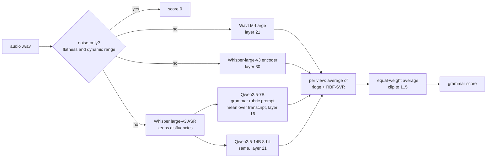

# Grammar Scoring Engine for Spoken English

My solution to the **SHL Hiring Assessment 2026** Kaggle challenge: given a 45 to 60 second recording of someone speaking English, predict the grammar score (0 to 5) that human raters gave it.

The full write-up (data findings, validation design, results, ablations, error analysis, fairness checks and next steps) is inside the notebook: **[`shl-grammar-scoring-final.ipynb`](shl-grammar-scoring-final.ipynb)**.

## Results

| | RMSE | Pearson |
|---|---|---|
| Training, in-sample (732 speech recordings) | 0.256 | 0.976 |
| Cross-validation, three fresh group-fold schemes (never used for any choice) | 0.538 | 0.853 |
| Cross-validation, weighted to the test mix of 45 s / 60 s clips | 0.538 | 0.840 |
| Baseline: always predict the mean (weighted) | 0.968 | ≈ 0 |

Public leaderboard: **0.3700** for the primary model, **0.3662** for the hedge that also uses text features (first single-feature baseline: 0.4182).

## Approach



* **Frozen representations, simple heads.** With 732 labelled recordings, I read out four strong pre-trained representations with ridge regression and an RBF-SVR rather than fine-tuning.
* **Two views of the same speech.** Two heads listen to the audio (how it sounds); two read the transcript with an LLM primed by the grammar rubric (what was said).
* **Validation that resists leakage.** Random K-fold put near-identical speakers and sessions on both sides of the split and overstated accuracy. Folds are grouped by acoustic similarity, checked against the test set, and weighted to the test mix of clip lengths.
* **A fairness check that found something.** Among speakers with the same human score, the model scores clearer (higher ASR confidence) and faster speech higher, so unfamiliar accents or poor microphones may be under-scored. The notebook measures this and lists how I would address it.
* **A pre-registered acceptance rule.** A change was kept only if it improved three fresh fold schemes by a fixed margin. Several plausible ideas failed it (HuBERT, wav2vec2, a literal CTC transcript, re-calibration, re-weighting); the notebook lists them.

## Reproducing

1. On Kaggle, create a notebook from `shl-grammar-scoring-final.ipynb` and attach the competition data.
2. Either set `RUN_EXTRACTION = True` (GPU T4 x2, internet on, about 2.5 hours) to rebuild all features from the audio, or attach the outputs of the feature notebooks in `experiments/` (`shl-01`, `shl-03`, `shl-05`, `shl-06`, `shl-11`, `shl-13`; plus `shl-04` and `shl-09` for the text ablation).
3. Run all cells. Modelling takes about 10 to 15 minutes on CPU and writes `submission.csv`.

Seeds are fixed (42 for folds and PCA, 0 for the SVR's PCA, 7/11/23 for the fresh fold schemes).

## Repository layout

```
shl-grammar-scoring-final.ipynb   single notebook: report, pipeline, results
experiments/                      the 18 development notebooks in the order I ran them (outputs removed)
  shl-01  data checks, EDA, zero rule, duration groups, test-mix weights
  shl-02  ASR (faster-whisper large-v3, word timestamps)
  shl-03  WavLM-Large features            shl-06  Whisper encoder features
  shl-04  text features (ASR timing, LanguageTool, GPT-2)
  shl-05  baseline and grouped CV design  shl-07 to shl-14  stacking iterations v1 to v5
  shl-09, shl-11, shl-13  Qwen 7B / 14B scores and pooled states
  shl-15  fresh-fold validation           shl-16 to shl-18  rejected ideas (HuBERT, wav2vec2, CTC)
requirements.txt
```

The Whisper layer sweep notebook (`shl-06b`) is not included; the same sweep is reproduced in Section 5 of the final notebook.

## Data notice

In line with the competition rules, this repository contains **code only**. No audio, labels, transcripts, embeddings or prediction files are included, and `.gitignore` blocks them. The notebook prints only aggregate statistics and plots.

## License

MIT, see [LICENSE](LICENSE).
